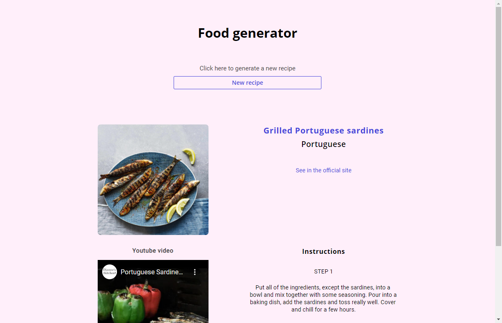
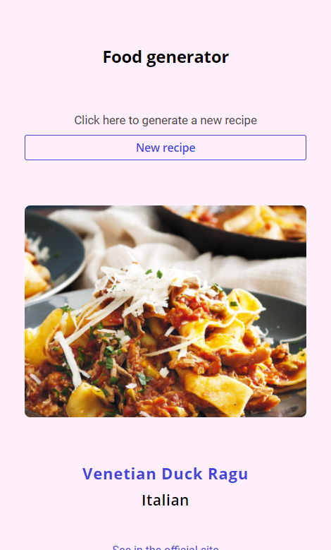

# random-meal

This app generates a random meal for the user.

# Technologies
In this project I used REACT.

The API I used to get Recipes was [TheMealDB API](https://www.themealdb.com/)

[This is a challenge of app-ideas by florinpop17](https://github.com/florinpop17/app-ideas/blob/master/Projects/1-Beginner/Random-Meal-Generator.md).

## Result

> ### See the result live [here](https://random-meal-lusk1nha.vercel.app/)

Desktop Version -

Mobile Version -

